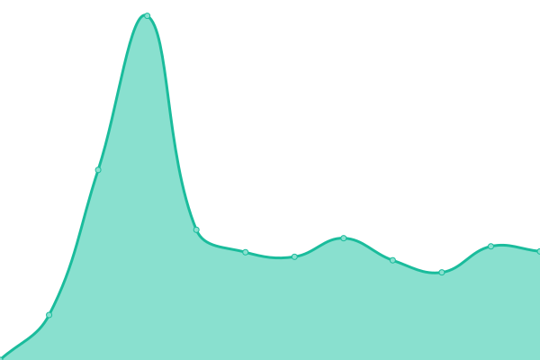
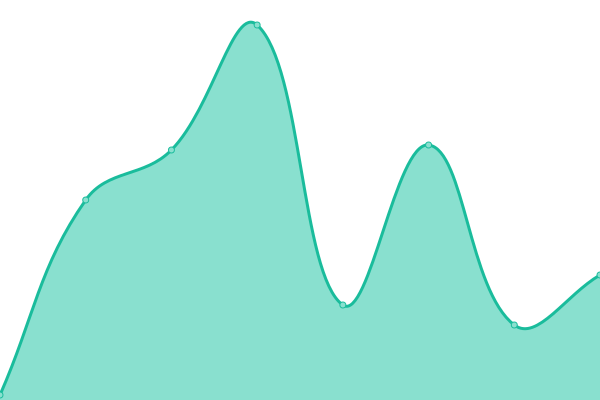

# [📈 Live Status](https://status.winterco.org): <!--live status--> **🟧 Partial outage**

This repository contains the open-source uptime monitor and status page for [Jabasukuriputo Wang](https://jsw3286.eu.org), powered by [Upptime](https://github.com/upptime/upptime).

With [Upptime](https://upptime.js.org), you can get your own unlimited and free uptime monitor and status page, powered entirely by a GitHub repository. We use [Issues](https://github.com/wfjsw/status-winterco-org/issues) as incident reports, [Actions](https://github.com/wfjsw/status-winterco-org/actions) as uptime monitors, and [Pages](https://status.winterco.org) for the status page.

<!--start: status pages-->
<!-- This summary is generated by Upptime (https://github.com/upptime/upptime) -->
<!-- Do not edit this manually, your changes will be overwritten -->
<!-- prettier-ignore -->
| URL | Status | History | Response Time | Uptime |
| --- | ------ | ------- | ------------- | ------ |
|  [Portal](https://winterco.org) | 🟩 Up | [portal.yml](https://github.com/wfjsw/status-winterco-org/commits/HEAD/history/portal.yml) | 

 2516ms
     
 | 

<a href="https://status.winterco.org/history/portal">99.79%</a>
    

|  [Forums](https://forums.winterco.org) | 🟩 Up | [forums.yml](https://github.com/wfjsw/status-winterco-org/commits/HEAD/history/forums.yml) | 

 968ms
     
 | 

<a href="https://status.winterco.org/history/forums">99.79%</a>
    

|  [SeAT](https://seat.winterco.space) | 🟥 Down | [se-at.yml](https://github.com/wfjsw/status-winterco-org/commits/HEAD/history/se-at.yml) | 

 1296ms
     
 | 

<a href="https://status.winterco.org/history/se-at">91.30%</a>
    

|  [Wiki](https://wiki.winterco.org) | 🟩 Up | [wiki.yml](https://github.com/wfjsw/status-winterco-org/commits/HEAD/history/wiki.yml) | 

 883ms
     
 | 

<a href="https://status.winterco.org/history/wiki">99.79%</a>
    

|  [BookStack](https://books.winterco.org) | 🟥 Down | [book-stack.yml](https://github.com/wfjsw/status-winterco-org/commits/HEAD/history/book-stack.yml) | 

 0ms
     
 | 

<a href="https://status.winterco.org/history/book-stack">0.00%</a>
    

|  [Data Intelligence](https://bi.winterco.org) | 🟩 Up | [data-intelligence.yml](https://github.com/wfjsw/status-winterco-org/commits/HEAD/history/data-intelligence.yml) | 

 859ms
     
 | 

<a href="https://status.winterco.org/history/data-intelligence">92.87%</a>
    

|  [Confluence](https://confluence.winterco.org) | 🟩 Up | [confluence.yml](https://github.com/wfjsw/status-winterco-org/commits/HEAD/history/confluence.yml) | 

 1018ms
     
 | 

<a href="https://status.winterco.org/history/confluence">99.78%</a>
    

|  [Jira](https://jira.winterco.org) | 🟥 Down | [jira.yml](https://github.com/wfjsw/status-winterco-org/commits/HEAD/history/jira.yml) | 

 1342ms
     
 | 

<a href="https://status.winterco.org/history/jira">0.00%</a>
    

|  [Waitlist](https://waitlist.winterco.org) | 🟩 Up | [waitlist.yml](https://github.com/wfjsw/status-winterco-org/commits/HEAD/history/waitlist.yml) | 

 622ms
     
 | 

<a href="https://status.winterco.org/history/waitlist">100.00%</a>
    

|  [Waitlist (API)](https://waitlist.winterco.org/api/auth/whoami) | 🟥 Down | [waitlist-api.yml](https://github.com/wfjsw/status-winterco-org/commits/HEAD/history/waitlist-api.yml) | 

 189ms
     
 | 

<a href="https://status.winterco.org/history/waitlist-api">73.10%</a>
    

|  [Short Links (API)](https://go.winterco.org/rest/health) | 🟩 Up | [short-links-api.yml](https://github.com/wfjsw/status-winterco-org/commits/HEAD/history/short-links-api.yml) | 

 805ms
     
 | 

<a href="https://status.winterco.org/history/short-links-api">98.74%</a>
    

|  [Short Links (Link)](https://wnt2.co) | 🟩 Up | [short-links-link.yml](https://github.com/wfjsw/status-winterco-org/commits/HEAD/history/short-links-link.yml) | 

 1313ms
     
 | 

<a href="https://status.winterco.org/history/short-links-link">99.19%</a>
    

|  [Jabber (CN)](jabber.winterco.cn) | 🟥 Down | [jabber-cn.yml](https://github.com/wfjsw/status-winterco-org/commits/HEAD/history/jabber-cn.yml) | 

 0ms
     
 | 

<a href="https://status.winterco.org/history/jabber-cn">0.00%</a>
    

|  [Mumble (CN)](mumble.winterco.cn) | 🟩 Up | [mumble-cn.yml](https://github.com/wfjsw/status-winterco-org/commits/HEAD/history/mumble-cn.yml) | 

 231ms
     
 | 

<a href="https://status.winterco.org/history/mumble-cn">100.00%</a>
    

|  [Mumble (US)](us.mumble.winterco.cn) | 🟩 Up | [mumble-us.yml](https://github.com/wfjsw/status-winterco-org/commits/HEAD/history/mumble-us.yml) | 

 51ms
     
 | 

<a href="https://status.winterco.org/history/mumble-us">100.00%</a>
    

|  [Mumble (JP)](jp.mumble.winterco.cn) | 🟥 Down | [mumble-jp.yml](https://github.com/wfjsw/status-winterco-org/commits/HEAD/history/mumble-jp.yml) | 

 0ms
     
 | 

<a href="https://status.winterco.org/history/mumble-jp">0.00%</a>
    

|  [Mumble (HK)](hk.mumble.winterco.cn) | 🟩 Up | [mumble-hk.yml](https://github.com/wfjsw/status-winterco-org/commits/HEAD/history/mumble-hk.yml) | 

 167ms
     
 | 

<a href="https://status.winterco.org/history/mumble-hk">100.00%</a>
    

|  Message Forwarder | 🟩 Up | [message-forwarder.yml](https://github.com/wfjsw/status-winterco-org/commits/HEAD/history/message-forwarder.yml) | 

 188ms
     
 | 

<a href="https://status.winterco.org/history/message-forwarder">100.00%</a>
    

|  [Bug Monitor (Third-Party)](https://bugreport.indexyz.me) | 🟥 Down | [bug-monitor-third-party.yml](https://github.com/wfjsw/status-winterco-org/commits/HEAD/history/bug-monitor-third-party.yml) | 

 140ms
     
 | 

<a href="https://status.winterco.org/history/bug-monitor-third-party">0.00%</a>
    

<!--end: status pages-->

[**Visit our status website →**](https://status.winterco.org)

## 📄 License

- Powered by: [Upptime](https://github.com/upptime/upptime)
- Code: [MIT](./LICENSE) © [Jabasukuriputo Wang](https://jsw3286.eu.org)
- Data in the `./history` directory: [Open Database License](https://opendatacommons.org/licenses/odbl/1-0/)
